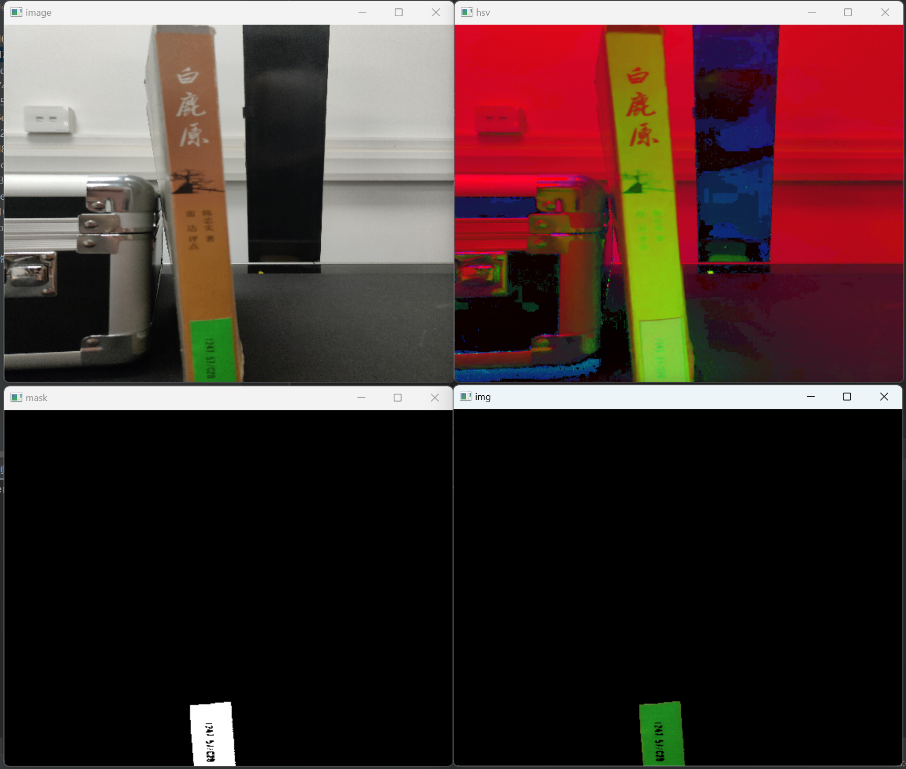
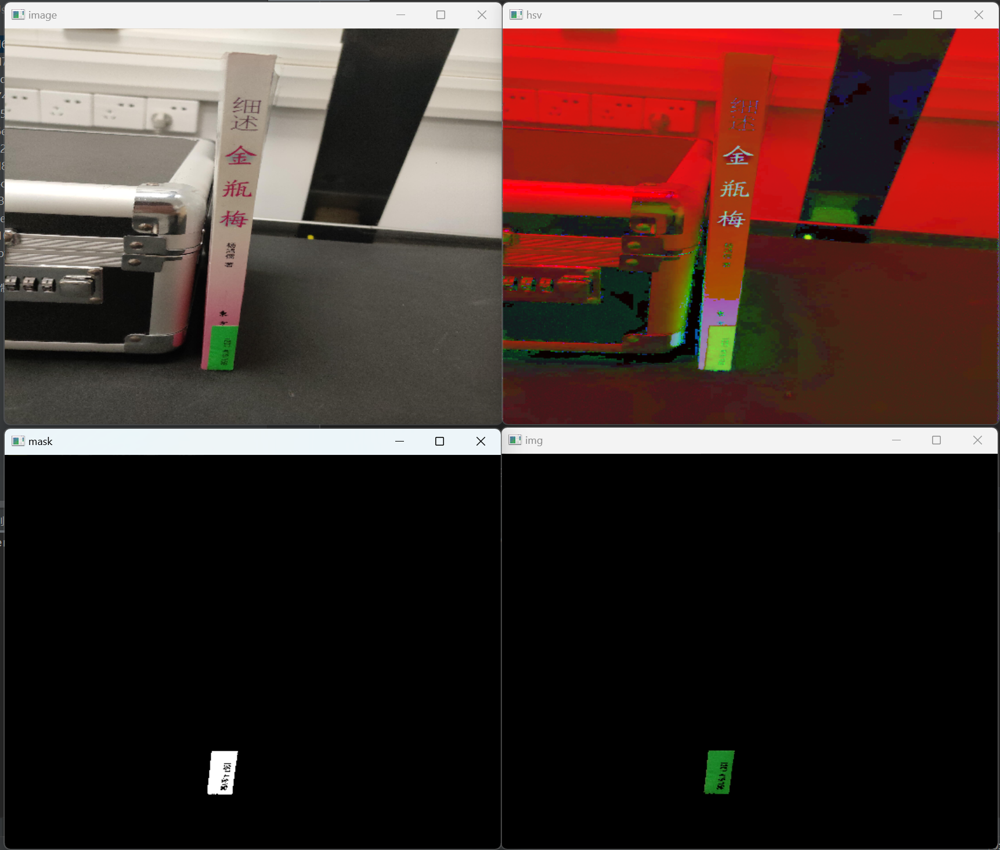
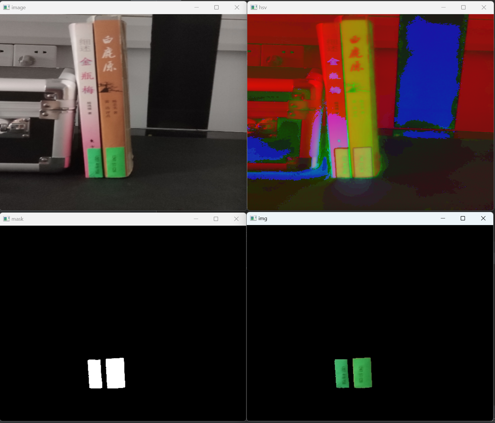
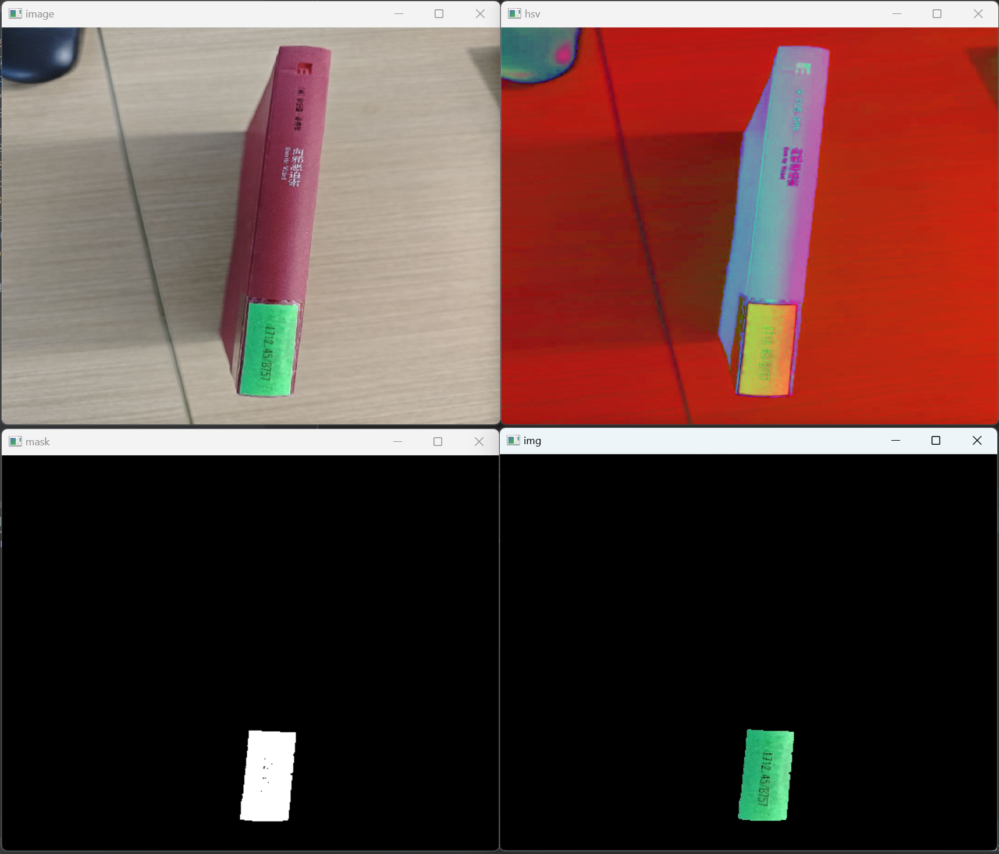
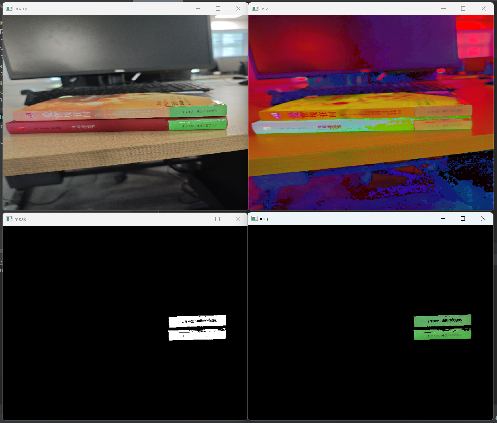

# OpenCV实现检测图书标签功能

## 1.代码主体

```python 
import cv2
import numpy as np

# 读取图像
image = cv2.imread('images/0041d6041d284552bd351001633fa62.jpg')

# 转换为 HSV 色彩空间
hsv = cv2.cvtColor(image, cv2.COLOR_BGR2HSV)
cv2.namedWindow('hsv', cv2.WINDOW_KEEPRATIO)
cv2.imshow('hsv', hsv)

# 定义绿色的范围
lower_green = np.array([35, 100, 100])
upper_green = np.array([85, 255, 255])

# 创建掩码
mask = cv2.inRange(hsv, lower_green, upper_green)
cv2.namedWindow('mask', cv2.WINDOW_KEEPRATIO)
cv2.imshow('mask', mask)


# 将绿色部分保留，其他部分变为黑色
img = cv2.bitwise_and(image, image, mask=mask)
cv2.namedWindow('img', cv2.WINDOW_KEEPRATIO)
cv2.imshow('img', img)


cv2.waitKey(0)
cv2.destroyAllWindows()


```

## 2.代码讲解

- 首先将图像读取进来，然后转换为HSV图像进行处理
- 接着设置一个绿色的阈值
- 利用设置的绿色阈值创建一个掩码
- 利用掩码对图片进行处理，将绿色部分保留，其余设置为黑色

## 3.效果展示












