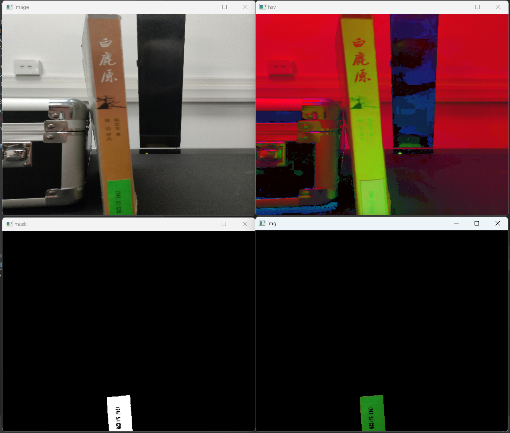
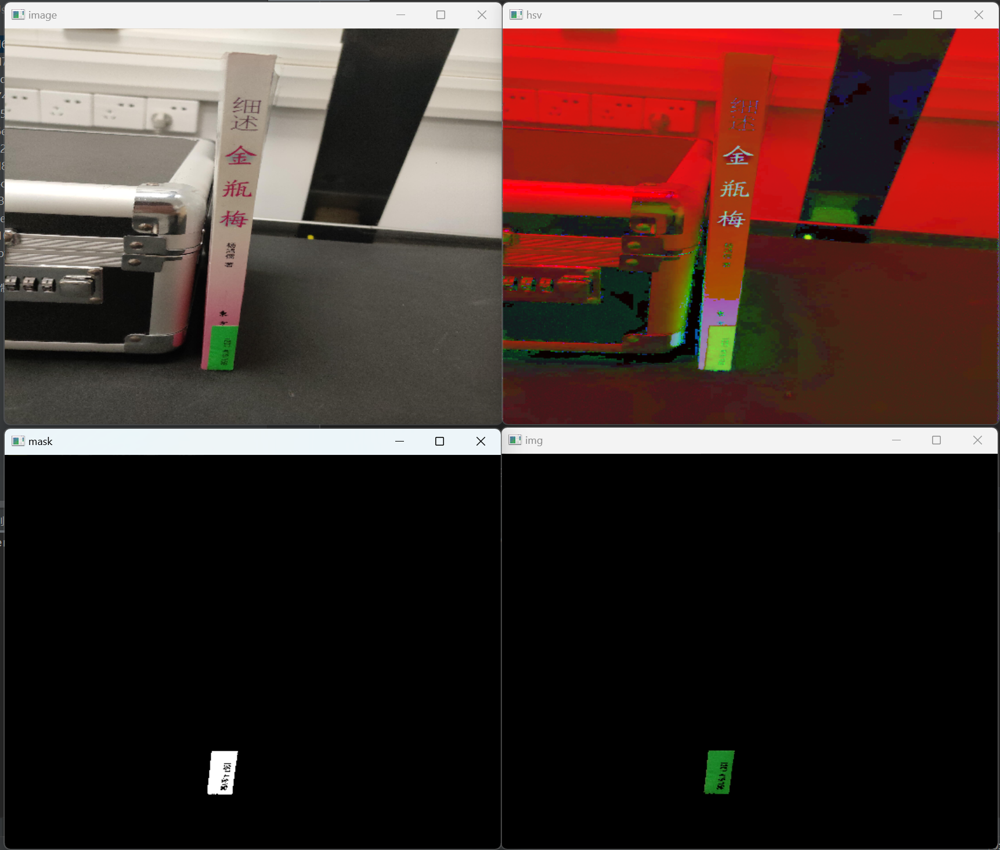
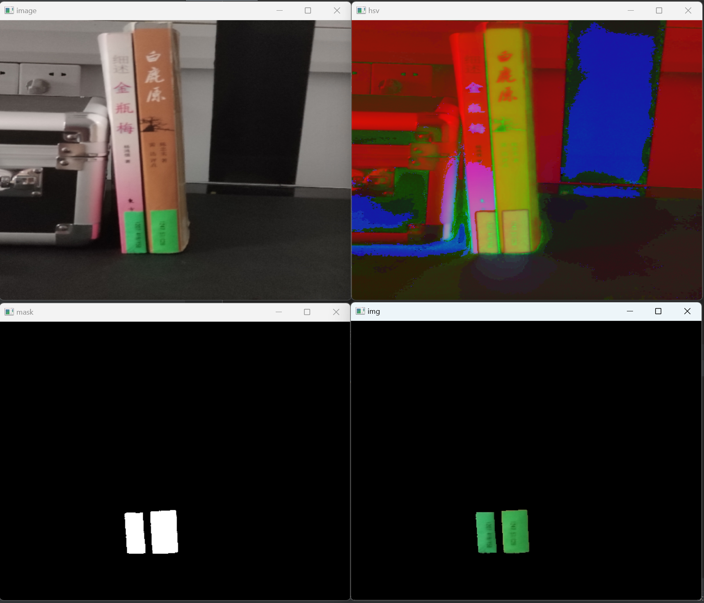
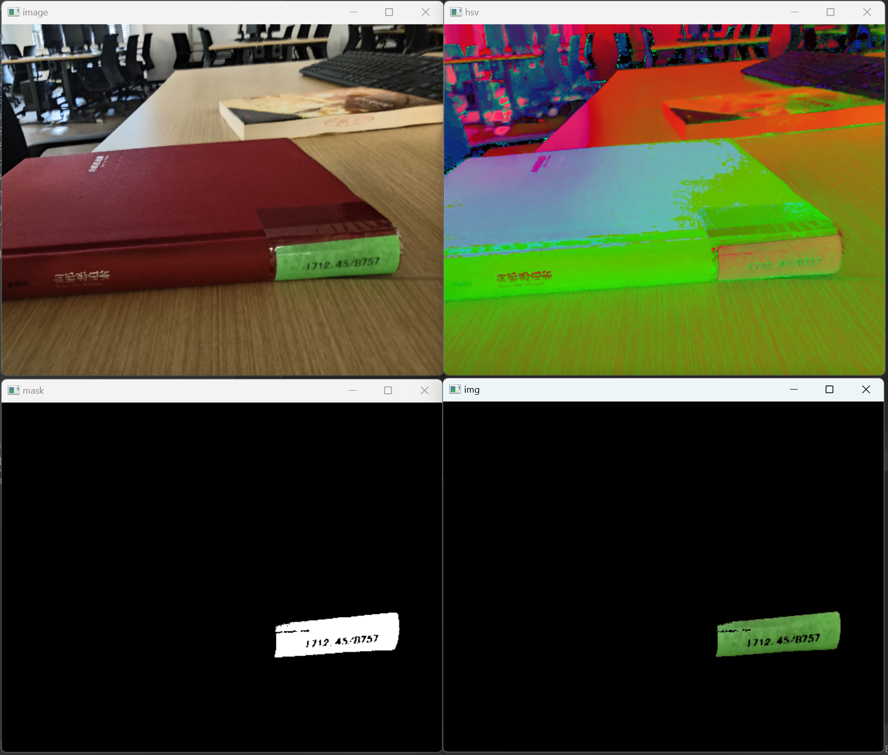
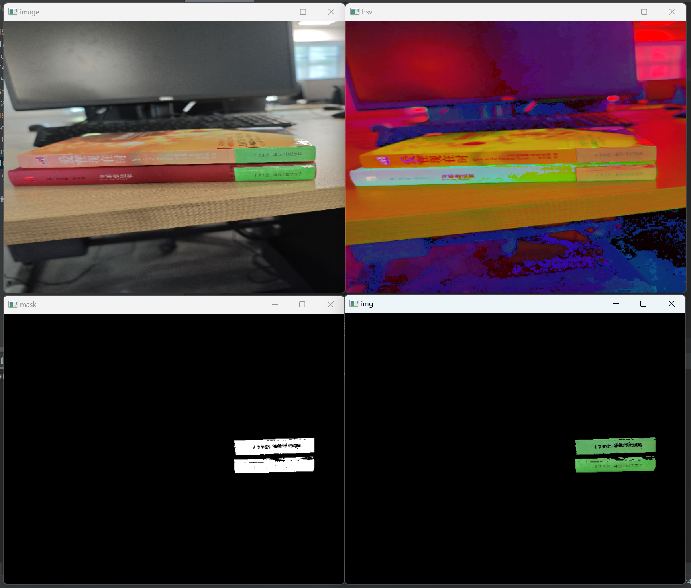
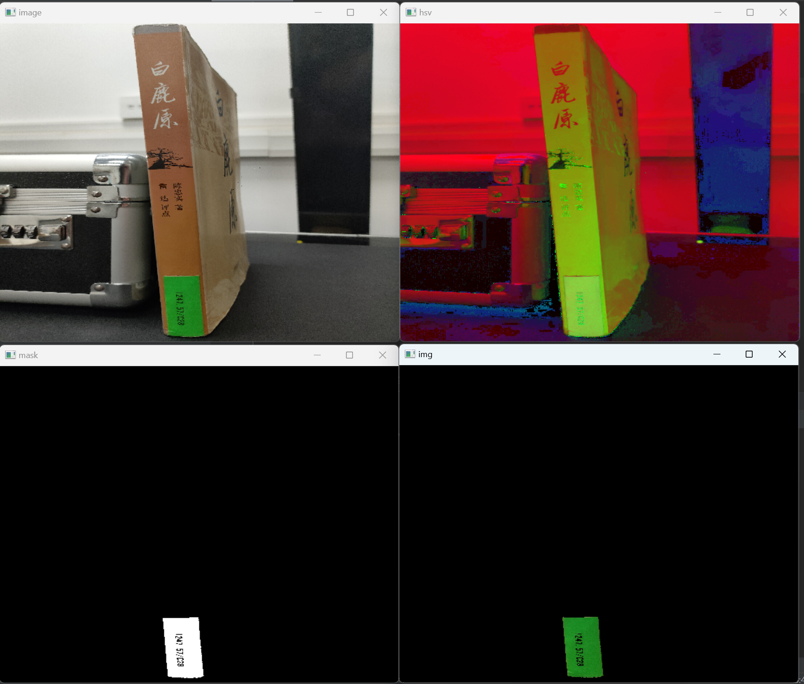

# OpenCV实现检测图书标签功能

## 1.代码主体

```python 
import cv2
import numpy as np
import os

# 设置图像文件夹路径
folder_path = 'images/'

# 获取文件夹中的所有文件名
file_names = os.listdir(folder_path)

# 遍历文件夹中的所有文件
for file_name in file_names:
    # 读取图像
    image_path = os.path.join(folder_path, file_name)
    image = cv2.imread(image_path)

    # 检查图像是否成功读取
    if image is None:
        print(f"Failed to load image: {image_path}")
        continue

    cv2.namedWindow('image', cv2.WINDOW_KEEPRATIO)
    cv2.imshow('image', image)

    # 转换为 HSV 色彩空间
    hsv = cv2.cvtColor(image, cv2.COLOR_BGR2HSV)
    cv2.namedWindow('hsv', cv2.WINDOW_KEEPRATIO)
    cv2.imshow('hsv', hsv)

    # 定义绿色的范围
    lower_green = np.array([35, 100, 100])
    upper_green = np.array([85, 255, 255])

    # 创建掩码
    mask = cv2.inRange(hsv, lower_green, upper_green)
    cv2.namedWindow('mask', cv2.WINDOW_KEEPRATIO)
    cv2.imshow('mask', mask)

    # 将绿色部分保留，其他部分变为黑色
    img = cv2.bitwise_and(image, image, mask=mask)
    cv2.namedWindow('img', cv2.WINDOW_KEEPRATIO)
    cv2.imshow('img', img)

    # 等待按键按下
    cv2.waitKey(0)
    cv2.destroyAllWindows()


```

## 2.代码讲解

1. **导入必要的库**:
    - `cv2` 用于处理图像的 OpenCV 库。
    - `numpy` 用于处理数组的 NumPy 库。
    - `os` 用于与操作系统进行交互。

2. **设置图像文件夹路径**:
    - `folder_path` 设置为包含图像的文件夹路径

3. **获取文件夹中的所有文件名**:
    - 使用 `os.listdir(folder_path)` 获取文件夹中的所有文件名，并将它们存储在 `file_names` 列表中。

4. **遍历文件夹中的所有文件**:
    - 使用 `for file_name in file_names:` 遍历文件夹中的每个文件名。

5. **读取图像**:
    - 构建每个图像的完整路径：`image_path = os.path.join(folder_path, file_name)`。
    - 使用 `cv2.imread(image_path)` 读取图像并存储在 `image` 变量中。

6. **检查图像是否成功读取**:
    - 如果图像读取失败，则 `image` 为 `None`。
    - 使用 `if image is None:` 检查是否成功读取图像，如果失败则打印错误消息并继续处理下一个文件。

7. **显示原始图像**:
    - 使用 `cv2.namedWindow` 创建一个窗口，并使用 `cv2.imshow` 显示原始图像。

8. **转换为 HSV 色彩空间**:
    - 使用 `cv2.cvtColor(image, cv2.COLOR_BGR2HSV)` 将图像从 BGR 色彩空间转换为 HSV 色彩空间，并显示转换后的图像。

9. **定义绿色的范围**:
    - 使用 `numpy` 数组定义 HSV 色彩空间中绿色的下界和上界：`lower_green` 和 `upper_green`。

10. **创建掩码**:
    - 使用 `cv2.inRange(hsv, lower_green, upper_green)` 创建一个掩码，只保留绿色部分，其余部分设为黑色，并显示掩码图像。

11. **将绿色部分保留，其他部分变为黑色**:
    - 使用 `cv2.bitwise_and(image, image, mask=mask)` 将绿色部分保留，其余部分变为黑色，并显示处理后的图像。

12. **等待按键按下**:
    - 使用 `cv2.waitKey(0)` 等待用户按键按下，然后关闭所有窗口：`cv2.destroyAllWindows()`。

通过这些步骤，代码可以遍历指定文件夹中的所有图像，对每个图像执行相同的处理操作，提取绿色部分并显示结果。

## 3.效果展示













